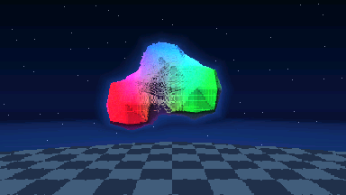
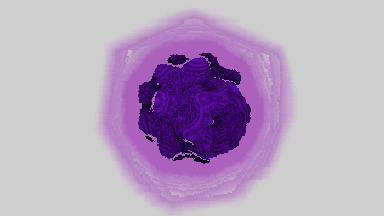

# Raymarcher-fx-CG50

Raymarcher is a real-time raymarch renderer add-in for the Casio fx-CG50 in native C. 

## Installation

1. Download `Raymarcher*.g3a` from the latest release.
2. Connect the fx-CG50 by USB and select **USB Flash**.
3. Copy the `.g3a` file to the root of the calculator drive.
4. Eject the calculator. The app will appear in the main menu.

## Controls

| Key | Action |
| --- | --- |
| Up / Down | Select a menu setting / orbit vertically |
| Left / Right | Change a menu setting / orbit horizontally |
| F1 / F2 | Zoom in / out |
| F3 | Render a native-resolution still of the current view |
| EXE | Start rendering |
| EXIT | Return to the menu, or quit |

## Live-render settings

| Setting | Description |
| --- | --- |
| Scene | Switches between four scenes |
| Live Pixels | 4x4, default, fastest; 3x3 and 2x2 trade speed for detail |
| Max Steps | Raymarch budget; also raises fractal iterations |
| Ambient Occlusion | Additional shading for primitive scenes |
| Animation | Moves the primitive scenes; sweeps Mandelbulb exponent |

## Method

The fx-CG50 processor has no floating-point, fixed point is used. 
The primitive scenes use signed-distance functions for spheres, boxes, pyramids and torus, including smooth blending and subtraction. 
The Mandelbulb uses a dedicated distance estimator. 
Some simple effects are used, like ambient occlusion, halo, color blending, as they are very cheap and improve aesthetics. 
Rendering is done at a reduced resolution for speed and integer scaled for full screen. 
